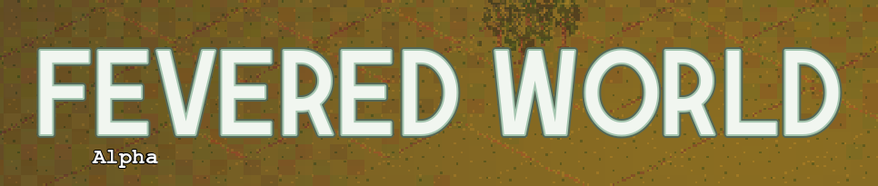
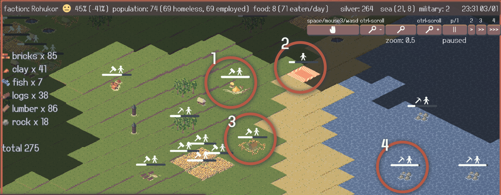

Linnaehitus- ja strateegiamäng "elusas maailmas".

Sinu ülesanne on juhtida oma inimesed jõuka elu poole. Selleks tuleb koguda ressursse ning luua töökohti, et ressursse töödelda millekski kasulikuks. Kui ressursse on puudu või üle, saab hõbeda vahendusel kaubelda oma naabritega. Ja kui see ei anna tulemusi, saab loomulikult sõjalise jõuga oma naabreid rünnata.

Kuid sama ülesanne on ka kõigil teistel riikidel. Igal mängukorral luuakse protseduuriliselt uus maailm. See jagatakse riikideks. Sinu riik on vaid üks ressursinäljas ja auahne teiste seas. Niisamuti nagu teised võivad olla Sinu algatatud sõja sihtmärgid, võid ka Sina olla kellegi teise kaubanduspartner või sõjalise röövimise ohver.

Pildi peal on näha järgnevad tegevused:

    1) turuhoone, kus käib kaubavahetus naabritega;
    2) maatükk, mille eest mängija on sõtta läinud;
    3) ehitus käib, et valmiks majutus riigi elanikele;
    4) ressursside kogumine kalastuskohast.

## Mängu käik

Kui oled varem mänginud strateegiamänge või linnaehitusmänge, võiks FEVERED WORLD Sulle üsna intuitiivne olla. Kui mitte, või lihtsalt huvi pärast, siis siin on pinnapealne *walkthrough*.

1. Maailma genereerimine ning riigi valimine: pane tähele raskusastet. Eelista alati "BREEZY" raskusastmega maatükke. Ressursse saab kaubanduse kaudu igal pool kätte, aga soovitan otsida koht, kus on Sinul või naabritel ligipääs savile (*clay*) ning rauale (*iron ore*).
2. Mängus sees on esimene probleem toit. Otsi lehtpuudelt puuvilju, kalastuskohtadest kala ja muud saadavalolevat. Töö loomiseks vajuta kaardiobjekti peale, topeltklõpsuga loo töökoht ning lohista siis peale arv töölisi. Kui inimesed nälgivad, muutuvad nad väga õnnetuks ning ei lepi enam Sinu juhtimisega.
3. Ehita kohe paar viljapõldu. Need on kindlam toiduallikas kui loodus, kuid võtavad rohkem aega, enne kui midagi toodavad. Ehitamiseks kasuta `BUILD`-menüüd ning vali ehitis, peale mida aseta see maha. See loob ehitusplatsi. Menüüst saad väljuda paremklõpsuga. Ehitusplatsil tuleb nagu ressursse kogudes lisada töölised, et töö üldse algaks.
4. Kui mäng veel ei käi, võta see pausilt maha klahviga `1`. Klahvid `2`-`4` muudavad mängusisese aja möödumise kiirust, soovitan seda 30x peal hoida. Liikuda saab mängualal hiirega kas keskmist klahvi või tühikut all hoides. Töötavad ka WASD ja noolenupud. Üldiselt kui on mingi tegevus võimalik kiirklahviga, siis on nupu kõrval või peal kirjas see klahv.
5. Kogu ka puitu ning ehita saekaater (*sawmill*). Sealt tulevad lauad on ehitusmaterjal suurtele majadele, mida saad kasutada oma rahva majutamiseks. Kui inimestel pole kodu, kukub Sinu kui juhi reiting. Reitingut saad uurida ülaribal, seal kus paistab (tõenäoliselt) kollane `:|` nägu. Muuseas on ülaribal palju infot. Kohati saab hiirt asjadele peale viies rohkemgi infot.
6. Laudadega ehita ka turuhoone (*marketplace*). Selle valmimisel tuleb lisada ka *Process Market* töökoht, mis tähistab turul kaupade vedamist jms. `TRADE`-menüüs saab turuhoone ja mainitud töökoha olemasolul vaadelda saadud kaubavahetuspakkumisi. Need tekivad töö käigus juurde, nii kuidas naabrid neid saadavad. Iga kaubavahetuspakkumine vahetab hõbedat (*silver*) mingi muu ressursi vastu. Riba lohistades muudad, kui suurt osa pakutud vahetuskaubast Sa vastu võtad. Saad saata ka enda pakkumisi teistele. See, kas nad neid vastu võtavad, sõltub aga sellest, kas neil on Sinu pakutud asju vaja (rääkimata sellest, kas neil on Sinu nõutud asjad üldse olemas).
7. Siinmaal on loodetavasti Sul juba käigus savi kaevamine ja sellest asjade valmistamine. Savi või muda on telliste algmaterjal, millega saab ehitada pagarikodasid ning sõjalisi objekte. Muda valmistamiseks on võimalus kasutada ka liiva ning vett. Liiva kaevamiseks on tarvis aga karjääri mõnes liivases kohas. Kui pole savi ega liiva (muda), proovi turul neid osta -- või alusta mängu otsast. 
8. Nüüdseks võib juba igav olla, nii et võib proovida sõtta minna. Ehitised nagu kasarmud (*barracks*) ja tornid suurendavad sõjalist võimu (*military power*). Väiksema sõjalise võimuga naabri vastu tehtud rünnakud kulgevad palju kiiremini. `MILIARY`-menüüs saab ringi klikata teiste riikide maatükkide peal ning sõdu alustada. Sõjaseisukorras saab alustada rünnakuid roheliseks värvitud ruutude vastu, need asuvad Sinu ja naabri ühise piiri peal. Naabri vallutamine võib olla raske ning palju aega võtta, nii et jälgi, et Sinu rahva muud vajadused on ikka kaetud...
9. Kui oled kogu maailma hõbeda ning ressursid endale krabanud, võid end õnnitleda ning mängu kinni panna. Järgmine kord teistsuguses maailmas... 

## Installimine

Githubis otsi üles viimane väljalase [releases](https://github.com/a-m-muru/tgame/tags)-sektsiooni alt. Tõmba alla ning paki lahti samasse kausta. Käivitatav binaarfail on kas .exe või .x86_64 laiendiga sõltuvalt operatsioonisüsteemist.

## Käitamine Godot'ga

Peale repositooriumi kloonimist saab selle avada Godot' C# redaktoriga.

Et mäng käima ka läheks, tuleb luua silbifailid, mille põhjal genereeritakse regioonide nimed. Selleks tuleb navigeerida kausta tools/silbitus ning jooksutada käsk `make`. Windowsil on selleks soovituslik kasutada mõnda MinGW keskkonda. Vajalikud on GNU Make, C kompilaator, iconv ning GNU Wget -- või üritus teha käsitsi sama asja, mida Makefile teeks.

